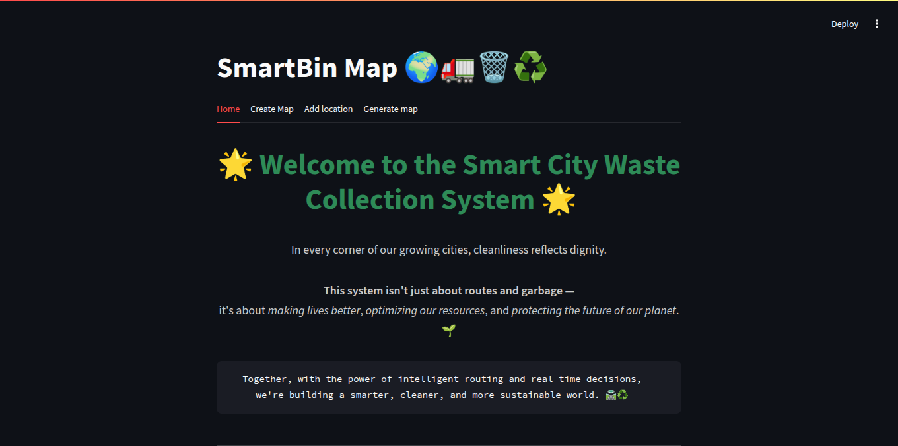
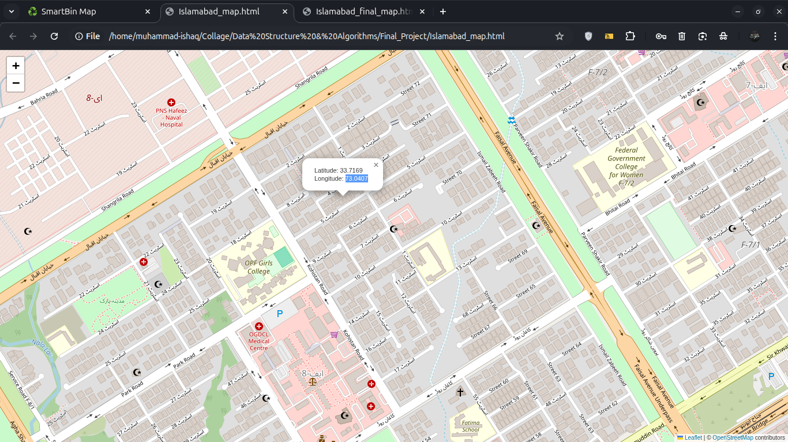
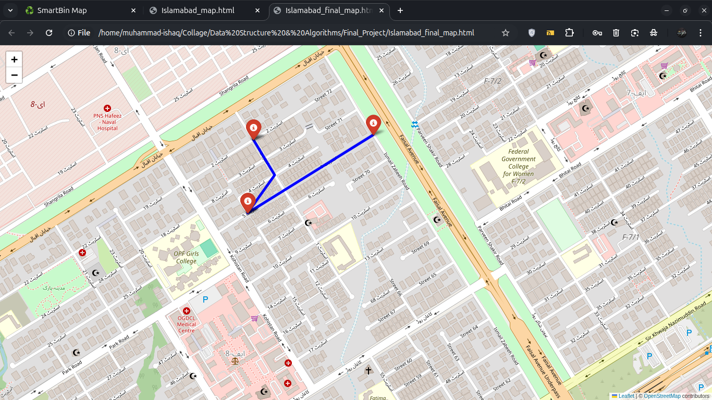

# Smart City Waste Collection System  
*A semester-project for Data Structures & Algorithms using graph models, MST, Kruskal’s & Prim’s algorithms to optimise waste-collection path.*

## 📌 Overview  
This project implements a waste-collection routing optimisation system for a smart city scenario. It latitude and longitude of the bins or collection points and uses Minimum Spanning Tree (MST) and tree/path-finding techniques (Kruskal’s & Prim’s) to compute an efficient route for collection.  
The aim is to reduce travel distance/time for waste-collection vehicles, thereby improving efficiency and lowering cost for municipal collection services.

## ⚙️ Features  
- Represent the city waste-collection network as a graph (nodes = collection points / bins, edges = roads with weights)  
- Compute an MST of the graph using Prim’s and/or Kruskal’s algorithm to identify a backbone route  
- Derive an optimal (or near-optimal) collection path from the MST (or augmented route)  
- Provide input files/scripts to define the graph (nodes, edges, weights)  
- GUI / command line interface (depending on implementation) to visualise or output the route  
- Database sync / persistent storage of graph data (via SQL script)  

##  📸  Screenshots
<div align="center">
  
</div>
<div align="center">
  
</div>
<div align="center">
  
</div>

## 📋 Requirements  
- Python 3.x  
- Required Python modules (given in requirment.txt):  
  ```bash
  pip install –r requirements.txt
  ```

  ## 🡇 Installation and Setup
  ###  1.  Clone or Download the project
  ```cmd
  git clone https://github.com/IshaqMuhammad/Smart-City-Waste-Collection-System
  cd ./Smart-City-Waste-Collection-System 
  cd Smart-City-Waste-Collection-System (//for window and MacOS)
  ```
  ###  2.  Installed Dependencies
  ```cmd
  pip install requirment.txt
  ```
  ###  3.  Run the project
  ```cmd
  streamlit run app.py
